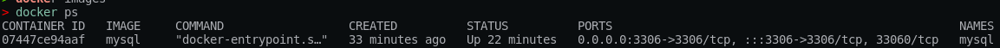
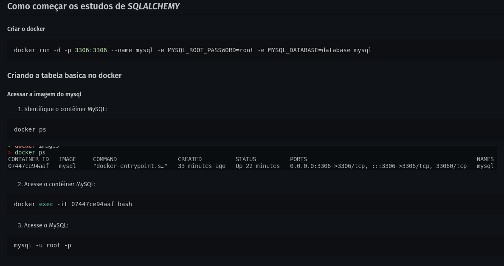

## Como começar os estudos de *SQLALCHEMY*
#### Criar o docker
```python
docker run -d -p 3306:3306 --name mysql -e MYSQL_ROOT_PASSWORD=root -e MYSQL_DATABASE=database mysql
```

### Criando a tabela basica no docker
#### Acessar a imagem do mysql
1. Identifique o contêiner MySQL:
```python
docker ps
```


2. Acesse o contêiner MySQL:


```python
docker exec -it 07447ce94aaf bash
```

3. Acesse o MySQL:
```python
mysql -u root -p
```
#### Não esqueça de colocar a senha __root__ nesta etapa

4. Criando o banco __cinema__
```python
CREATE DATABASE IF NOT EXISTS cinema;

USE cinema;

CREATE TABLE IF NOT EXISTS filmes (
    titulo VARCHAR(50) NOT NULL,
    genero VARCHAR(30) NOT NULL,
    ano INT NOT NULL,
    PRIMARY KEY(titulo)
);

CREATE TABLE IF NOT EXISTS atores (
    id BIGINT NOT NULL AUTO_INCREMENT,
    nome VARCHAR(50) NOT NULL,
    titulo_filme VARCHAR(50) NOT NULL,
    PRIMARY KEY(id),
    FOREIGN KEY (titulo_filme) REFERENCES filmes(titulo)
);

INSERT INTO filmes (titulo, genero, ano)
VALUE ("Forest Gump", "Drama", 1994);

INSERT INTO atores (nome, titulo_filme)
VALUE ("Tom Hanks", "Forest Gump");
```
---

#### Preparando o ambiente *python*
```python
poetry shell
poetry install
```
---
#### Acompanhe o Simple-Sample para ter uma visão basica do funcionamento do sqlalchemy

[Simple-Sample](Simple-Sample.ipynb)